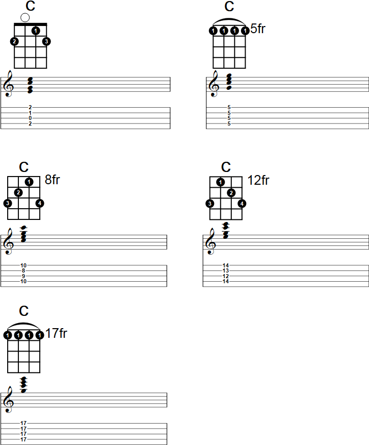
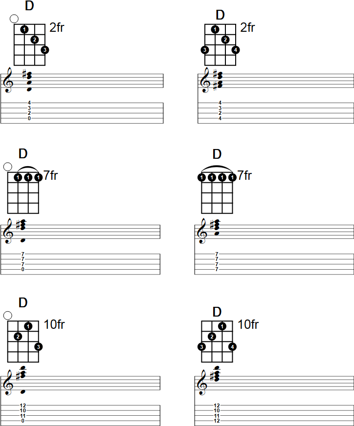
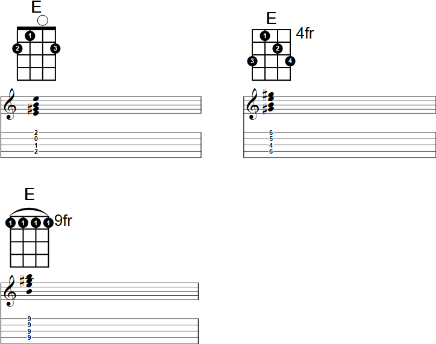
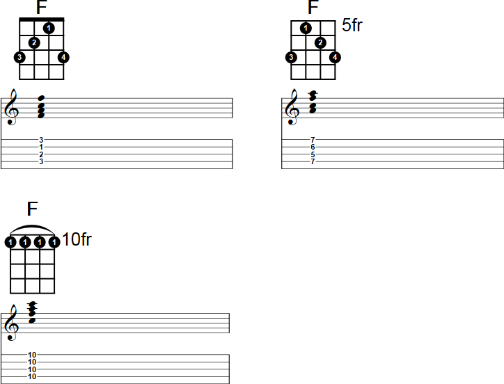
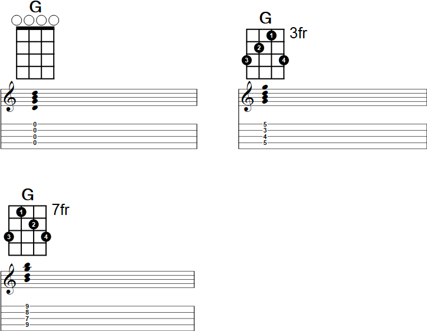
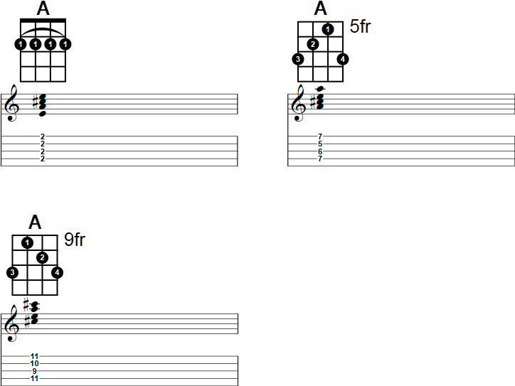
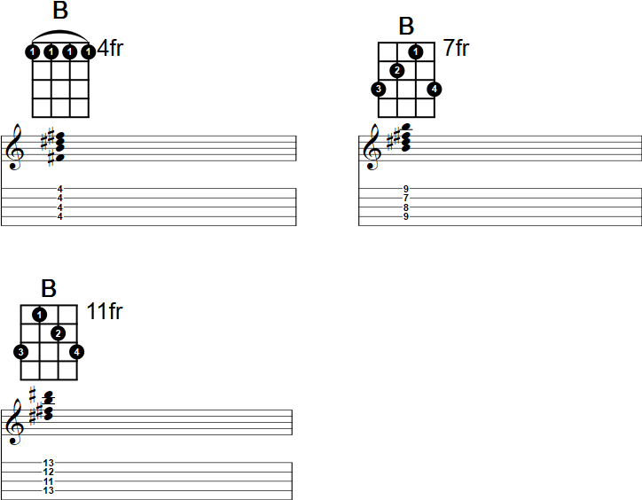

<table id="contents">
    <tr>
        <td><a href="#c">C</a></td>
        <td><a href="#d">D</a></td>
        <td><a href="#e">E</a></td>
        <td><a href="#f">F</a></td>
        <td><a href="#g">G</a></td>
        <td><a href="#a">A</a></td>
        <td><a href="#b">B</a></td>
    </tr>
</table>

<h1 id="c">C</h1>

[up](#contents)

<h1 id="d">D</h1>

[up](#contents)

<h1 id="e">E</h1>

[up](#contents)

<h1 id="f">f</h1>

[up](#contents)

<h1 id="g">G</h1>

[up](#contents)

<h1 id="a">A</h1>

[up](#contents)

<h1 id="b">B</h1>

[up](#contents)

