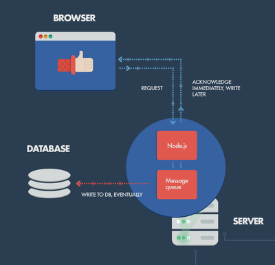
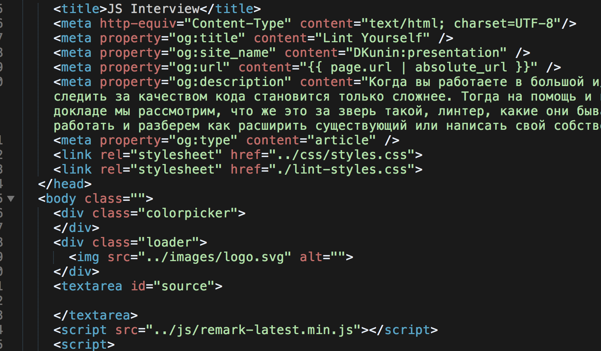
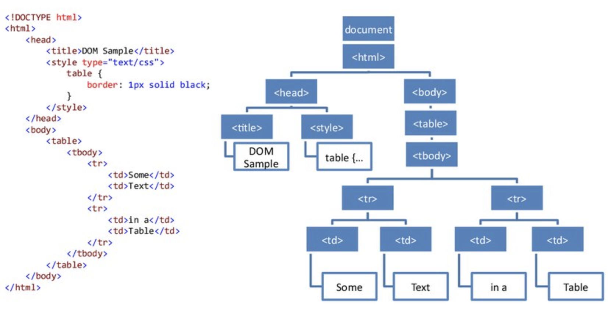
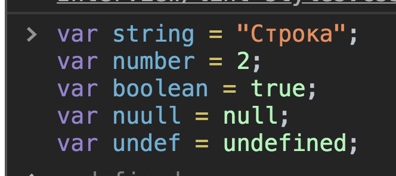
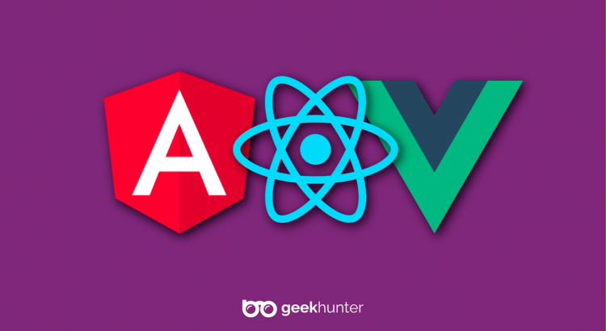
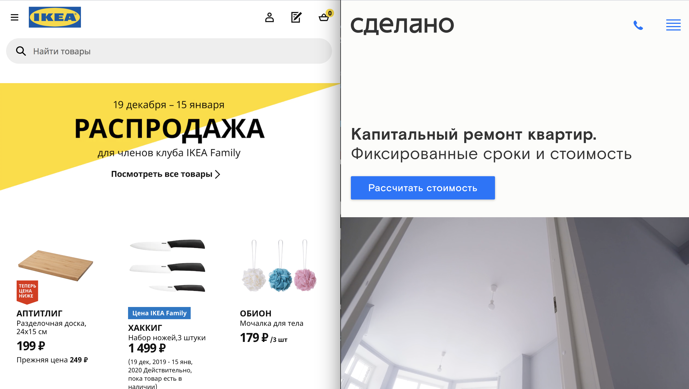

class: center, middle

## Введение в JavaScript

---

class: center, middle

## План на сегодня
- Знакомство
- Теоретическая часть
	- Где применяется JS
	- Общие термины Javascript
	- Хайп/ключевые слова
- Практическая часть
- Вопросы

---
class: center, middle

## Теоретическая часть

---
class: center, middle

## Браузер


- Браузер получает всю информацию при загрузке страницы
- Или Javascript загружает данные асинхронно, для чего используется технология AJAX

---
class: center, middle

## Сервер



---

class: center, middle

## Мобильные устройства

- C помощью адаптеров напр. Cordova

---

class: center, middle

## HTML



---

class: center, middle

## Загрузка JS

```
<script src="../js/remark-latest.min.js"></script>

или

<script>
const rootNode = document.getElementById('source');
const loaderNode = document.querySelector('.loader');
</script>

```

---
class: center, middle

## HTML => JS (DOM)



- После загрузки JS - он представляет для себя HTML в виде DOM (Document Object Model). 
- Для JavaScript это карта, с помощью которой можно работать с тем, что отображается на странице 
- DOM узел - имеет набор свойств - напр. положение, тип, визуальные характеристикиы

---

class: center, middle

## Примитивы



---

class: center, middle

## Объект

```
 const cat = {
 	color: "brown",
 	icon: '🐈',
 	height: 2,
 	meow: function() {
 		return "Myav";
 	}
 }
```

- Объект - это сущность у которой может быть набор свойств и методов, состоящих из примитивов

---

class: center, middle

## Массив

```
const housemates = ['👩', '👨', '👶', '🐈'];
```

- Массив - набор элементов/объектов

---

class: center, middle

## Функция


```
function cleanTheHouse() {
	return '👨 начинает уборку'; 
}

cleanTheHouse();

```

- Функция - логический блок, который может манипулировать как простыми так и сложными объектами

---

class: center, middle

## Параметры

```
function cleanTheHouse(someone) {
	return someone + ' начинает уборку'; 
}

cleanTheHouse('🐈');
// 🐈 начинает уборку

cleanTheHouse('👨');
// 👨 начинает уборку

```

- Параметры функции - то, что мы можем передать внутрь функции для получения разных результатов

---

## Условия

class: center, middle

```
function cleanTheHouse(someone, wet) {
	if (wet) {
		return someone + ' начинает влажную уборку'; 
	}

	return someone + ' начинает уборку'; 
}

cleanTheHouse('🐈', true);
// 🐈 начинает влажную уборку

cleanTheHouse('🐈', false);
// 🐈 начинает уборку

```

- Логические блоки, условия по которым мы можем понять нужно ли продолжать действия или нет

---

class: center, middle

## Библиотеки и Фреймворки

- Для более простой работы из-за повторения действий готовятся инструменты: **Библиотеки и Фреймворки**
- Например вместо того чтобы писать сложный компонент с нуля, можно найти готовое решение


---

class: center, middle

## Ключевые отличия: Фреймворк
- позволяет просто писать бизнес логику и не думать о том, как двигаются блоки на экране 
- Пример популярного фреймворка: Vue.js, Angular

---

class: center, middle

## Ключевые отличия: Библиотека
- набор вспомогательных функций, которые ни диктуют никаких условий, их надо просто собрать
- Пример популярной библиотеки: React, Redux



---

class: center, middle

## Почему люди идут в JS разработку

- Нет компиляции - выполнение в браузере
- Моментальная обратная связь 

---

class: center, middle

## Начало интервью

---

class: center, middle

## Над каким проектом вы сейчас работаете?

---

class: center, middle

- "Делаю задачки для сайта / верстаю блоки / делаю виджеты / чиню баги / верстаю сайты-визитки"
- **Перед нами**: Исполнитель, разработчик начального-среднего уровня
- **Почему**: Из-за срочных или поточных одинаковых задач - нет возможности к развитию
- **Риск**: Медленное или отсутствующее развитие

---

class: center, middle


- "Делаю фронт для проекта хелпдеска в компании, это SPA приложение..."
- **Перед нами**: Скорее всего уверенный мидл
- **Почему**: Кандидат понимает направленность продукта, смотрит на него более широко, ключевые слова SPA - более сложная разработка

---

class: center, middle


## Опишите текущий процесс работы над проектом

---

class: center, middle

- "Менеджер/Тимлид говорит что делать"
- **Перед нами** : Исполнитель
- **Почему** : любит решать задачи а не проблемы, не захочет разбираться самостоятельно в проблеме
- **Риски** : Потребует бОльших инвестиций с точки зрения постановки задач


---

class: center, middle

- "Мы тратим много времени на спринты, стендапы, цели ставит компания".
- **Перед нами** : Исполнитель
- **Почему** : видит скрам, как "глупый формализм"
- **Риски** : Не будет выкладываться на полную и может строить искусственную бюрократию

---
class: center, middle

- "Мы планируем спринты, стендапы, ставим цели в соответствии с глобальными целями компании".
- **Перед нами** : Уверенный мидл, как минимум
- **Почему** : видит потенциал скрама как инструмента и использует его на благо команды

---

class: center, middle

- "Мы обсуждаем с заказчиком ожидания пользователя и формируем UserStory, который будет идеально помогать пользователю выполнять..."
- **Перед нами** : Высокомотивированный профессионал, который хочет решать проблемы, а не задачи.

---

class: center, middle

- "Ну как получаю задачку - отвожу ветку от мастера, делаю комиты, мержу в мастер после тестирования"
- **Перед нами** : Исполнитель
- **Почему** : видит работу, как писать код, а не решать пользовательские проблемы

---

class: center, middle

## Дополнительный вопрос:
- Кто отвечает за качество?
- **Хороший ответ** : Команда
- **Средний ответ** : QA специалист
- **Риски** : Не будет брать на себя достаточно ответственности

---
class: center, middle

## Как бы Вы выстроили разработку, если бы была полная свобода действий?

---
class: center, middle

- "Да так же..."
- **Перед нами** : Исполнитель
- **Почему** : Безынициативность, низкая мотивация, не ищет улучшения процессов
- **Риски** : Не будет брать на себя достаточно ответственности, не будет развиваться

---
class: center, middle

- "Все бы переделал с нуля, потому что предыдущие разработчики были не компетентны, я смогу лучше, потому что я лучше знаю"
- **Перед нами** : Элитист/Зазнайка
- **Почему** : Уверенность в своей правоте и превосходстве над предшественниками/остальной командой
- **Риски** : Даже если он действительно умнее и знаешь лучше - неуменее/нежелание основательно аргументировать позицию сделает его в команде - гением-изгоем, с которым никто не хочет работать

---
class: center, middle

- "Все бы переделал с нуля, потому что предыдущая команда имела ряд ограничений, которых не существует сейчас и сейчас есть более точная картина как все должно работать"
- **Перед нами** : Сеньор
- **Почему** : Понимание проблем прошлого и/или текущего - дают возможность построить картину идеального мира

---
class: center, middle

- "Все бы переделал с нуля..."
- Если кандидат не пояснил чего ради нужна переделка с нуля - то...
- **Перед нами** : Идеалист
- **Почему** : Понимание, что система не абсолютно эффективна и/или неэлегантна недостаточно для того, чтобы ее переделывать
- **Риски** : Улучшения такого инженера будут бесконечным циклом, так как система живая, всегда можно будет что-то улучшить, ради улучшения

---

class: center, middle

## Какие вопросы на текущий момент?

---
class: center, middle

## При разработке - если используется простой HTML - предпочитаете сами верстать или отдать это другому/специальному человеку? Почему? Почему JS Вам интереснее?

---

class: center, middle

- Да, у нас есть отдельный верстальщик, я верстать не приемлю/нелюблю
- **Перед нами** : Элитист
- **Почему** : не готов взять ответственность за свой продукт, видит классовое разделение инженеров
- **Риски** : Будет стараться не брать "неинтересные" для него задачи

---
class: center, middle

- Работа с DOM/HTML такая же часть моей работы
- **Перед нами** : Твердый мидл
- **Почему** : Готов брать ответственность за полный цикл работ над проектом

---

class: center, middle

## В проекте X - какую технологию Вы выбрали? Почему? Почему не Vue/React/Родной?

---
class: center, middle

- "Мы выбрали реакт потому что у этой технологии есть преимущества а),б),в), перед остальными на рынке специфично для данного проекта"
- **Перед нами** : Твердый мидл+
- **Почему** : Понимание выбора технологии показывает осознанность и отсутствие склонности к хайпу

---
class: center, middle

- "Нам сказали использовать реакт потому что это популярно, я не знаю точно почему"
- **Перед нами** : Исполнитель
- **Почему** : Плывет по течению, соглашается с решениями, не оспаривая и не подвергая сомнению
- **Риски** : Безынициативность, отсутствие роста

---
class: center, middle

- "Я пришел, решил все наладить и перевел всех на X, потому что у этой технологии есть преимущества а),б),в), перед остальными на рынке специфично для данного проекта. Выбор этой технологии позволил нам ускорить доставку"
- **Перед нами** : Сеньор
- **Почему** : Осознает преимущество технологий в зависимости от контекста, готов брать на себя ответственность за выбор технологического пути команды/компании

---
class: center, middle

## Пишете ли тесты для приложения? Почему нет? Какие тесты вы бы заложили по любому, если бы было время?
---
class: center, middle

- "Я не пишу тесты, так как не вижу в них смысла"
- **Перед нами** : Джуниор
- **Почему** : Не понимает преимуществ автотестирования, видов автотестов существует большое количество, в одних проектах нужны такие или другие, нет проекта, который бы не получил выгоду от автотестирования, сделанного правильно.
- **Риски** : Если компания сильно полагается на автотесты на регрессионном тестировании - кандидат потребует больших вложений, прежде чем наконец возьмется за написание тестов

---

class: center, middle

- "Я пишу немного юнитов и компонентых тестов, end-to-end тесты пишет наш автоматизатор"
- **Перед нами** : Миддл/Сеньор
- **Почему** : Понимает пирамиду тестирования и преимущества разных видов тестов, готов сам вкладывать и разделять работу по повышению уровня покрытия тестами
