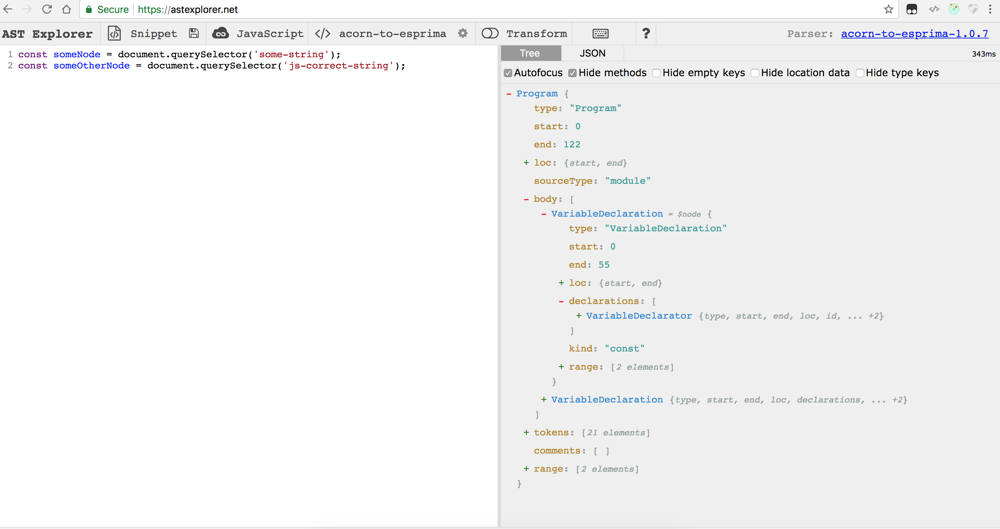
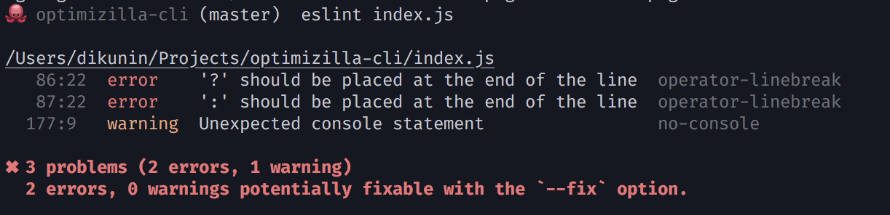

class: center, middle

## Lint Yourself
##### expand one, build one

---
class: center, middle

### Кто я?

- Дмитрий Кунин
- avito.ru, tech unit lead, trust and safety
- @dkunin

---
class: center, middle

### В конце

- ссылки на материалы
- примеры кода
- ссылка на презентацию

---

class: list-center

### О чем я расскажу

- Что делает линтер
- Как он это делает
- С чем его приготовить
- Куда его положить
- Собственные правила для esLint
- Кастомный линтер

???

Профит - понимая как рабоатет любой линтер - его легче расширить или писать свой или дебажить

---
class: center, middle

### Lint

Undesirable bits of fiber and fluff found in sheep's wool

???
- Лишние скобки, недостающие скобки
- Недообъявленная переменная, переобъявленная переменная

---
class: list-center

### В чем преимущества линтинга

- ~~Головная боль~~

--

- Общие стили

--

- Меньше ошибок

--

- Кастомизация

???

Нацелен на ускорение кода, защиту от мелких нежелательных кусков fiber and fluff
Линтер запускается перед тестами, приводит к единому своду правил

---
class: list-center

### Популярные линтеры

- JSLint
<div></div>

--

- JSHint

--

- EsLint

--

- TsLint

--

- styleLint

--

- textLint

--

- Prettier (+-)
- ShellCheck (+-)
- WebHint (+-)

---

class: list-center

### Процесс Линтинга

- Исходный код

--

- Парсер AST

--

- Анализатор (+ плагины)

--

- Список ошибок

--

- (Опционально) Fix


---

class: middle
codehighlight: [1, 2, 4, 10]

```
var esprima = require('esprima');
var program = 'const answer = 42';

esprima.tokenize(program);
[ { type: 'Keyword', value: 'const' },
  { type: 'Identifier', value: 'answer' },
  { type: 'Punctuator', value: '=' },
  { type: 'Numeric', value: '42' } ]
  
esprima.parseScript(program);
{ type: 'Program',
  body:
   [ { type: 'VariableDeclaration',
       declarations: [Object],
       kind: 'const' } ],
  sourceType: 'script' }
```

---
class: middle, center, no-padding, nopages



---
class: list-center

### Настройки линтеров

- .eslintrc
- .stylelintrc
- tslint.json / tslint.yaml
- .textlintrc
- package.json (!)

---

class: list-center

### eslint-plugin-compat

package.json:
```
{
  // ...
  "browserslist": ["last 1 versions", "not ie <= 8"],
}
```

---


### Тип запуска CLI

```bash
eslint index.js
```


---

### Тип запуска Node

codehighlight: [1, 2, 11, 14]

```
const CLIEngine = require('eslint').CLIEngine;
const cli = new CLIEngine({
  parserOptions: {
    ecmaVersion: 6,
  },
  rules: {
    'no-unused-vars': 'off',
  }
});

const report = cli.executeOnText("let foo = 'bar';;").results[0];

if (report.errorCount) {
  console.log(report.messages);
} else {
  console.log('No errors');
}
```

---

class: list-center

### Как встроить его во флоу
- при сохранении
- git precommit/prepush/prerecieve
- CI-step

---

class: list-center

### Ингридиенты для кастомного планига eslint

- Конфиг
- Функция
- Фикс
- Пре/постпроцессинг
- Тесты

---

### Пример правил eslint

codehighlight: [2, 5]

```
{
    "plugins": [
        "@avito/custom-rules"
    ],
    "rules": {
        "eqeqeq": "off",
        "curly": "error",
        "quotes": ["error", "double"],
        "@avito/custom-rules/prefer-js-prefix": [1, { "multiline": true }],
        ...
    }
}
```

---

### Кастомное правило eslint

codehighlight: [3, 6, 7, 14]

```
module.exports = {
    meta: { ... },
    create: function(context) {
        // context => parserOptions/ruleId/options/settings etc.
        return {
            CallExpression: function(node) {
                if (
                    getNestedProperty(node, 'callee.property.name') ===
                        'querySelector' &&
                    !getNestedProperty(node, 'arguments.0.value').startsWith(
                        '.js-'
                    )
                ) {
                    context.report(
                        node,
                        'Use js-* prefix for accessing DOM nodes',
                        function(fixer) {
                          return ...;
                        }
                    );
                }
            }
        };
    }
};
```

---

codehighlight: [8, 9, 14]

```
const rule = require('./prefer-node-suffix');
const RuleTester = require('eslint').RuleTester;

RuleTester.setDefaultConfig(...);

const ruleTester = new RuleTester();

ruleTester.run('prefer-node-suffix', rule, {
    valid: [
        'const itemsNode = document.querySelector(".js-items");',
        'const obj = {}; obj.tabsNode = itemsNode.querySelector(".js-tabs");'
    ],

    invalid: [
        {
            code: 'const items = document.querySelector(".js-items");',
            errors: [
                {
                    message: 'Use postfix Node, when accessing DOM nodes, items => itemsNode',
                    type: ''
                }
            ]
        }
    ]
});
```
---

class: center, middle

### Пре/постпроцессинг


```
processors: {
    ".ext": {
        preprocess: function(text, filename) {
            return [string];
        },
        postprocess: function(messages, filename) {
            return [Message];
        },
        supportsAutofix: true
    }
}
```

---

codehighlight: [4, 12, 13]

### Кастомное правило tslint

```
  import * as ts from "typescript";
  import * as Lint from "tslint";

  export class Rule extends Lint.Rules.AbstractRule {
      public static FAILURE_STRING = "import statement forbidden";

      public apply(sourceFile: ts.SourceFile): Lint.RuleFailure[] {
          return this.applyWithWalker(new NoImportsWalker(sourceFile, this.getOptions()));
      }
  }

  class NoImportsWalker extends Lint.RuleWalker {
      public visitImportDeclaration(node: ts.ImportDeclaration) {
          // ... some logic ...
          this.addFailure(this.createFailure(node.getStart(), node.getWidth(), Rule.FAILURE_STRING));
          super.visitImportDeclaration(node);
      }
  }
```


---

### Кастомное правило stylelint

```
var stylelint = require("stylelint")

var ruleName = "plugin/foo-bar"
var messages =  stylelint.utils.ruleMessages(ruleName, {
  expected: "Expected ...",
})

module.exports = stylelint.createPlugin(ruleName, function(primaryOption, secondaryOptionObject) {
  return function(postcssRoot, postcssResult) {
    var validOptions = stylelint.utils.validateOptions(postcssResult, ruleName, { .. })
    if (!validOptions) { return }
    // ... some logic ...
    stylelint.utils.report({ .. })
  }
})

module.exports.ruleName = ruleName
module.exports.messages = messages
```

---

### Кастомное правило textlint

```
import { parse } from "txt-to-ast";
export default class TextProcessor {
    constructor(options = {}) {
        this.options = options;
        this.extensions = this.config.extensions ? this.config.extensions : [];
    }
    availableExtensions() {
        return [".txt", ".text"].concat(this.extensions);
    }
    processor(ext) {
        return {
            preProcess(text, filePath) {
                return parse(text);
            },
            postProcess(messages, filePath) {
                // Lint logic
                return {
                    messages,
                    filePath: filePath ? filePath : "<text>"
                };
            }
        };
    }
}
```

---
class: list-center

### Как разработать кастомный линтер

- Разобрать на AST
- Научить программу "граматике"
- Написать правила/функции
- Вывести список ошибок
- (Опционально) Fix

---

class: list-center

### Инструменты

- NodeJS
- Существующий парсер (chevrotain)

---

### Демо/Описание процессов

```markdown
---
class: middle

### Настройки линтеров

- .eslintrc
--
- .stylelintrc

---
```

---

```
const chevrotain = require('chevrotain');
const Parser = require('chevrotain').Parser;

const slideShowString = fs.readFileSync('./simpler.md').toString();
const createToken = chevrotain.createToken;
const Lexer = chevrotain.Lexer;
const Identifier = createToken({ name: "Identifier", pattern: /[a-zA-Z]\w*/ })
const ClassHeader = createToken({ name: 'ClassHeader', pattern: /class:/ , longer_alt: Identifier});

```

---

class: center, middle, nopages

# Вопросы?

.blue[dkun.in]

.blue[@DKunin]

---

# Полезные материалы
- https://eslint.org/docs/developer-guide/working-with-plugins
- https://stylelint.io/developer-guide/plugins/
- https://palantir.github.io/tslint/develop/custom-rules/
- https://github.com/dustinspecker/awesome-eslint
- https://github.com/caramelomartins/awesome-linters
- https://github.com/SAP/chevrotain
- https://github.com/acornjs/acorn
- https://github.com/jquery/esprima

???

- Ограничение по параметрам
- Прыжки-попрыжки с tslint
- Доработать плагин
