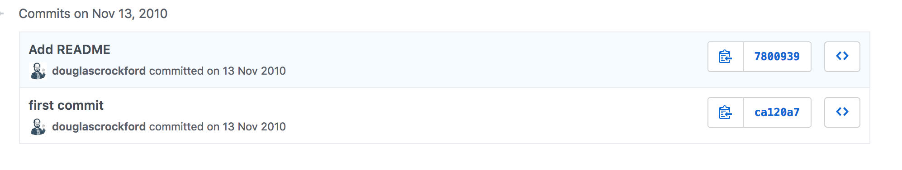

class: center, middle

## Lint Yourself
##### expand one, build one

---
class: center, middle

### Кто я?

- Дмитрий Кунин
- avito.ru, tech unit lead, trust and safety
- @dkunin

---
class: center, middle

### В конце

- ссылки на материалы
- примеры кода
- ссылка на презентацию

---
class: list-center
### Небольшой опрос

- Человеческая ошибка

--

- Невнимательность

--

- Гремлины

---

class: center, middle, no-padding, nopages


---


class: center, middle, no-padding, nopages


---

class: list-center

### План

- Что делает линтер
- Как он это делает
- С чем его приготовить
- Куда его положить
- Собственные правила для esLint
- Кастомный линтер

<div class="gizmo-walk-se"></div>

???

Профит - понимая как рабоатет любой линтер - его легче расширить или писать свой или дебажить

---

class: list-center

### Что пакостят гремлины

- Лишние скобки, недостающие скобки
- Недообъявленная переменная
- Переобъявленная переменная
- Переопределенная константа
- == вместо ===
- ...

---

class: list-center

### План

<ul>
  <li class="current-plan-step">Что делает линтер</li>
  <li class="secondary">Как он это делает</li>
  <li class="secondary">С чем его приготовить</li>
  <li class="secondary">Куда его положить</li>
  <li class="secondary">Собственные правила для esLint</li>
  <li class="secondary">Кастомный линтер</li>
</ul>

---
class: list-center

### Чем поможет линтер

- ~~Головная боль~~

--

- Общие стили

--

- Меньше ошибок

--

- Кастомизация


---
class: list-center

### Популярные линтеры

- JSLint
<div></div>

--

- JSHint

--

- EsLint

--

- TsLint

--

- styleLint

--

- textLint

--

- Prettier (+-)
- ShellCheck (+-)
- WebHint (+-)


---

class: list-center

### План

<ul>
  <li class="secondary">Что делает линтер</li>
  <li class="current-plan-step">Как он это делает</li>
  <li class="secondary">С чем его приготовить</li>
  <li class="secondary">Куда его положить</li>
  <li class="secondary">Собственные правила для esLint</li>
  <li class="secondary">Кастомный линтер</li>
</ul>

---

class: list-center

- Исходный код

--

- Парсер AST

--

- Анализатор (+ плагины)

--

- Список ошибок

--

- (Опционально) Fix


---

class: middle
codehighlight: [1, 2, 4, 10]

```
var esprima = require('esprima');
var program = 'const answer = 42';

esprima.tokenize(program);
[ { type: 'Keyword', value: 'const' },
  { type: 'Identifier', value: 'answer' },
  { type: 'Punctuator', value: '=' },
  { type: 'Numeric', value: '42' } ]
  
esprima.parseScript(program);
{ type: 'Program',
  body:
   [ { type: 'VariableDeclaration',
       declarations: [Object],
       kind: 'const' } ],
  sourceType: 'script' }
```

---
class: middle, center, no-padding, nopages


---
class: list-center

### План

<ul>
  <li class="secondary">Что делает линтер</li>
  <li class="secondary">Как он это делает</li>
  <li class="current-plan-step">С чем его приготовить</li>
  <li class="secondary">Куда его положить</li>
  <li class="secondary">Собственные правила для esLint</li>
  <li class="secondary">Кастомный линтер</li>
</ul>

---
class: list-center

### Настройки линтеров

- .eslintrc
- .stylelintrc
- tslint.json / tslint.yaml
- .textlintrc
- package.json (!)

---

class: list-center

### eslint-plugin-compat

package.json:
```
{
  // ...
  "browserslist": ["last 1 versions", "not ie <= 8"],
}
```

---


### Тип запуска CLI

```
eslint index.js
```


---

### Тип запуска Node

codehighlight: [1, 2, 11, 14]

```
const CLIEngine = require('eslint').CLIEngine;
const cli = new CLIEngine({
  parserOptions: {
    ecmaVersion: 6,
  },
  rules: {
    'no-unused-vars': 'off',
  }
});

const report = cli.executeOnText("let foo = 'bar';;").results[0];

if (report.errorCount) {
  console.log(report.messages);
} else {
  console.log('No errors');
}
```
---

class: list-center

### План

<ul>
  <li class="secondary">Что делает линтер</li>
  <li class="secondary">Как он это делает</li>
  <li class="secondary">С чем его приготовить</li>
  <li class="current-plan-step">Куда его положить</li>
  <li class="secondary">Собственные правила для esLint</li>
  <li class="secondary">Кастомный линтер</li>
</ul>

---

class: list-center

### Как встроить его во флоу
- при сохранении
- git precommit/prepush/prerecieve
- CI-step

---

class: list-center

### План

<ul>
  <li class="secondary">Что делает линтер</li>
  <li class="secondary">Как он это делает</li>
  <li class="secondary">С чем его приготовить</li>
  <li class="secondary">Куда его положить</li>
  <li class="current-plan-step">Собственные правила для esLint</li>
  <li class="secondary">Кастомный линтер</li>
</ul>

---

class: list-center

### Ингридиенты для кастомного плагина eslint

- Конфиг
- Функция
- Фикс
- Пре/постпроцессинг
- Тесты

---

### Пример правил eslint

codehighlight: [2, 5]

```
{
    "plugins": [
        "@avito/custom-rules"
    ],
    "rules": {
        "eqeqeq": "off",
        "curly": "error",
        "quotes": ["error", "double"],
        "@avito/custom-rules/prefer-js-prefix": [1, { "multiline": true }],
        ...
    }
}
```

---

### Кастомное правило eslint

codehighlight: [3, 6, 7, 14]

```
module.exports = {
    meta: { ... },
    create: function(context) {
        // context => parserOptions/ruleId/options/settings etc.
        return {
            CallExpression: function(node) {
                if (
                    getNestedProperty(node, 'callee.property.name') ===
                        'querySelector' &&
                    !getNestedProperty(node, 'arguments.0.value').startsWith(
                        '.js-'
                    )
                ) {
                    context.report(
                        node,
                        'Use js-* prefix for accessing DOM nodes',
                        function(fixer) {
                          return ...;
                        }
                    );
                }
            }
        };
    }
};
```

---

codehighlight: [8, 9, 14]

```
const rule = require('./prefer-node-suffix');
const RuleTester = require('eslint').RuleTester;

RuleTester.setDefaultConfig(...);

const ruleTester = new RuleTester();

ruleTester.run('prefer-node-suffix', rule, {
    valid: [
        'const itemsNode = document.querySelector(".js-items");',
        'const obj = {}; obj.tabsNode = itemsNode.querySelector(".js-tabs");'
    ],

    invalid: [
        {
            code: 'const items = document.querySelector(".js-items");',
            errors: [
                {
                    message: 'Use postfix Node, when accessing DOM nodes, items => itemsNode',
                    type: ''
                }
            ]
        }
    ]
});
```
---

class: center, middle

### Пре/постпроцессинг


```
processors: {
    ".ext": {
        preprocess: function(text, filename) {
            return [string];
        },
        postprocess: function(messages, filename) {
            return [Message];
        },
        supportsAutofix: true
    }
}
```

---

codehighlight: [4, 12, 13]

### Кастомное правило tslint

```
  import * as ts from "typescript";
  import * as Lint from "tslint";

  export class Rule extends Lint.Rules.AbstractRule {
      public static FAILURE_STRING = "import statement forbidden";

      public apply(sourceFile: ts.SourceFile): Lint.RuleFailure[] {
          return this.applyWithWalker(new NoImportsWalker(sourceFile, this.getOptions()));
      }
  }

  class NoImportsWalker extends Lint.RuleWalker {
      public visitImportDeclaration(node: ts.ImportDeclaration) {
          // ... some logic ...
          this.addFailure(this.createFailure(node.getStart(), node.getWidth(), Rule.FAILURE_STRING));
          super.visitImportDeclaration(node);
      }
  }
```


---

### Кастомное правило stylelint

```
var stylelint = require("stylelint")

var ruleName = "plugin/foo-bar"
var messages =  stylelint.utils.ruleMessages(ruleName, {
  expected: "Expected ...",
})

module.exports = stylelint.createPlugin(ruleName, function(primaryOption, secondaryOptionObject) {
  return function(postcssRoot, postcssResult) {
    var validOptions = stylelint.utils.validateOptions(postcssResult, ruleName, { .. })
    if (!validOptions) { return }
    // ... some logic ...
    stylelint.utils.report({ .. })
  }
})

module.exports.ruleName = ruleName
module.exports.messages = messages
```

---

class: list-center

### План

<ul>
  <li class="secondary">Что делает линтер</li>
  <li class="secondary">Как он это делает</li>
  <li class="secondary">С чем его приготовить</li>
  <li class="secondary">Куда его положить</li>
  <li class="secondary">Собственные правила для esLint</li>
  <li class="current-plan-step">Кастомный линтер</li>
</ul>


---
class: list-center

### Что нужно уметь линтеру

- Разбирать на AST
- Бегать по AST
- Выводить ошибки
- (Опционально) Исправлять ошибки

---

class: list-center

### Подходы

- Новый синтаксис
- Расширенный синтаксис

???

- Обучаемый парсер (напр. Ohmlang) + walker + reporter
- Универсальный парсер с плагинами

---

class: middle

```
---

class: list-center

### Подходы

- Новый синтаксис
- Расширенный синтаксис

???

- Обучаемый парсер (напр. Ohmlang) + walker + reporter
- Универсальный парсер с плагинами

---
```

---

class: list-center

### Обучаемый парсер

- Текст в AST
- Грамматика
- Функция хождения
- Вывод ошибок

---

class: middle

### Обучаемый парсер

```
NLDatalog.grammar = ohm.grammar(`
  NLDatalog {
    Rules
      = ListOf<Rule, "\\n">
    Rule
      = Clause          -- fact
    Clause
      = ( classRow | word )+
    word = wordChar+
    classDecl = "class: "
    classRow = classDecl (className ("," className)*)*
    className = classChar+
    classChar = ~(eol | "," | "\\n") any
    wordChar = any
    eol = "\\r"? "\\n"
  }
`);
```

---

class: middle

```
RemarkJSSlider.semantics = RemarkJSSlider.grammar
  .createSemantics()
  .addOperation('toAST', {
    Rules(rules) {
      return new Program(rules.toAST());
    },

    Rule_fact(head) {
      return new Rule(head.toAST(), []);
    },
    ...
```
---

class: middle
codehighlight: [1, 4, 6, 11]

```
const walker = new ASTWalker();

const linter = {
  ClassRow(node, parent) {
    if (node.classNames.length === 0) {
      throw new Error('No ClassRows should be empty');
    }
  }
}

walker.traverse(ast,
{
   enterNode: (node, parent) =>
   {  
      if (node.type && linter[node.type]) {
        linter[node.type](node, parent)
      }
   }
});
```

---

class: list-center

### Кастомизация существующего (unified)

- Markdown => доп. токены => AST
- Правило на доп. токены
- ~~Функция хождения~~
- ~~Вывод ошибок~~

---

class: center, middle

```
function tokenClassListSeparator(process, value) {
    const match = /^class:(.+)/g.exec(value);
    if (match) {
        return process(match[0])({
            type: 'classRow',
            children: [{ type: 'classList', value: match[0] }]
        });
    }
}
```
---

### Добавление правила к набору правил

```
  const visit = require('unist-util-visit');
  const reason = 'ClassName cannot be empty';

  function visitor(file) {
      return (node) => {
          ...// checking classList
          if (classList.length === 0) {
              file.message(reason);
          }
      };
  }

  function noEmptyClassList(tree, file) {
      visit(tree, 'classList', visitor(file));
  }

  module.exports = noEmptyClassList;

```

---
class: middle
codehighlight: [2, 3, 5, 6, 10,11]
```
//...
const noEmptyClassListToken = require('./no-empty-class-list-token');
const noEmptyClassListRule = require('./no-empty-class-list-rule');
//...
const extraRule = rule('remark-lint:no-empty-class-list-rule', noEmptyClassListRule);
guide.plugins = guide.plugins.concat(extraRule);

remark()
    .use(markdown)
    .use(noEmptyClassListToken)
    .use(guide)
    .use(html)
    .process(slides, function(err, file) {
        console.error(report(err || file));
    });

```

---

### Итого

- Что делает линтер
- Как он это делает
- С чем его приготовить
- Куда его положить
- Собственные правила для esLint
- Кастомный линтер

---

class: center, middle, nopages


---

class: center, middle, nopages

# Вопросы?

.blue[dkun.in]
.blue[@DKunin]

---

# Полезные материалы
- https://eslint.org/docs/developer-guide/working-with-plugins
- https://stylelint.io/developer-guide/plugins/
- https://palantir.github.io/tslint/develop/custom-rules/
- https://github.com/dustinspecker/awesome-eslint
- https://github.com/caramelomartins/awesome-linters
- https://github.com/SAP/chevrotain
- https://github.com/acornjs/acorn
- https://github.com/jquery/esprima
- https://github.com/sindresorhus/awesome-lint
- https://github.com/syntax-tree/unists
- https://github.com/unifiedjs/unified
- https://github.com/DKunin/ohm-example
- https://github.com/DKunin/unified-test